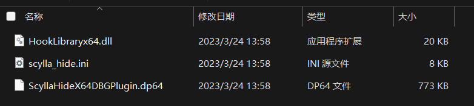
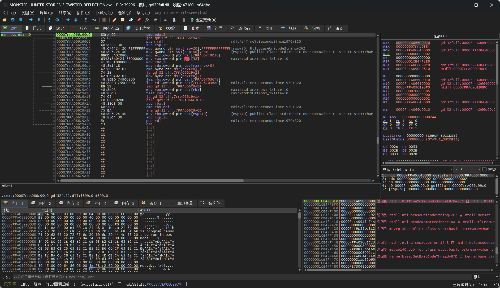
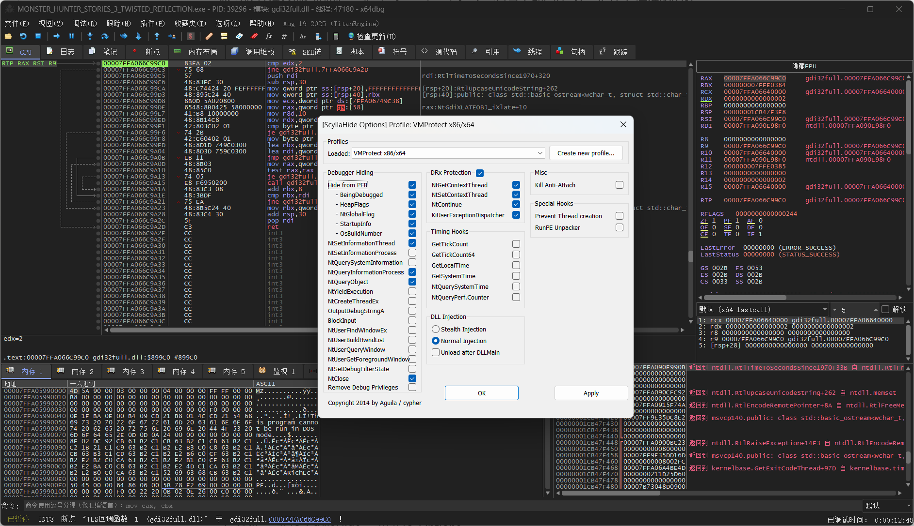
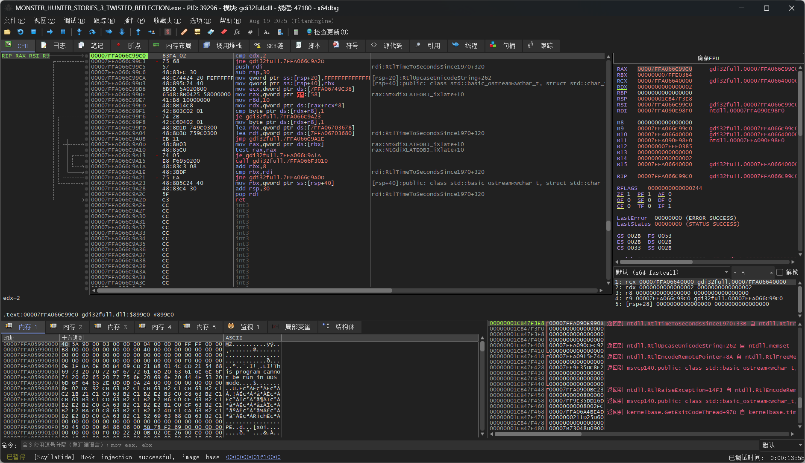
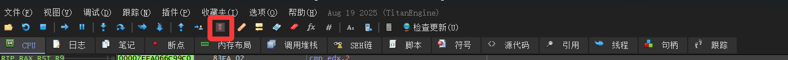
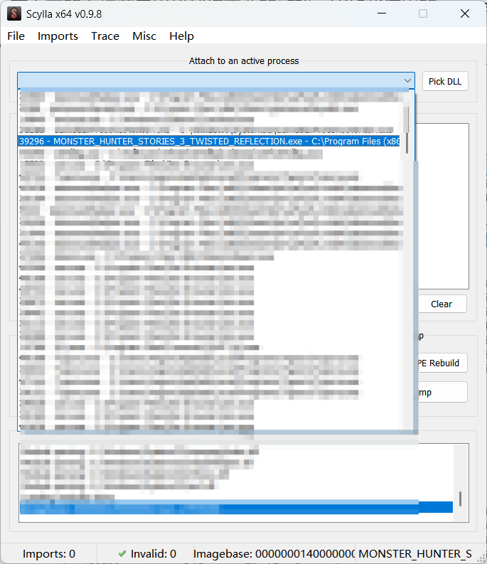
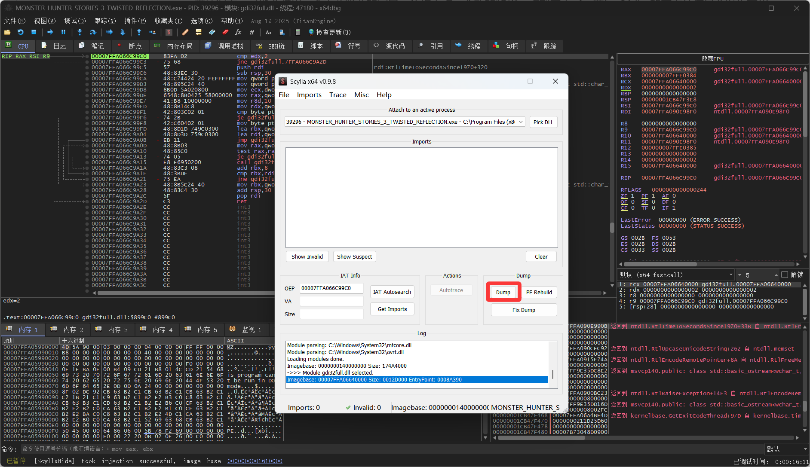
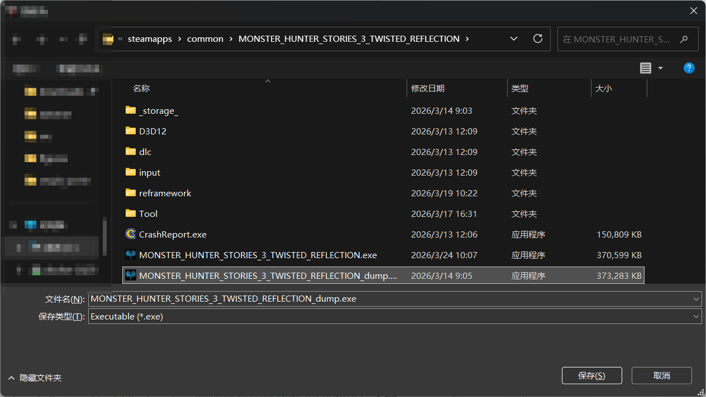
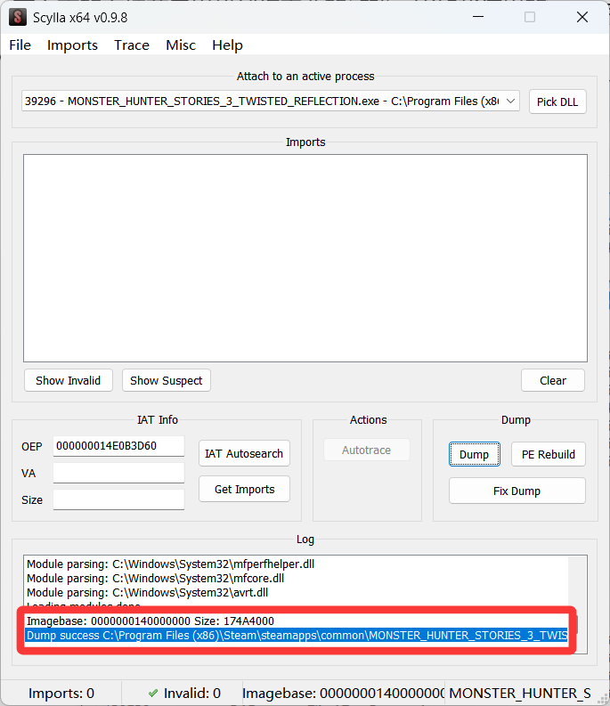
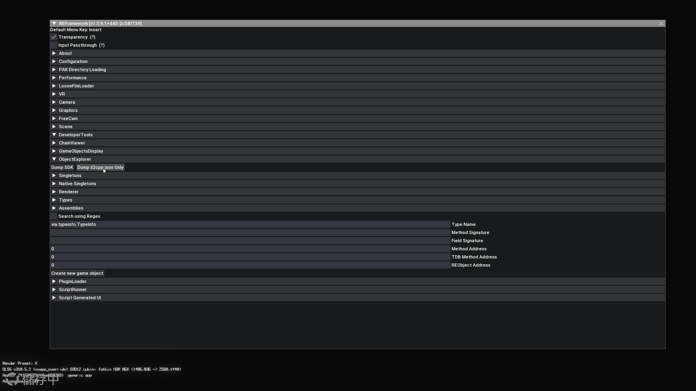

# 从0开始的JSON大包导出教程

阅读前应该了解的事项和工具准备：

- 仅支持Windows运行环境，其他系统自己想办法调整操作；
- 游戏本身需要是卡婊的RE引擎，并且了解这个项目目前只能导出RE引擎的`.user.3`数据包文件；
- 需要有其他大佬为游戏生成了`.list`文件，例如[这个项目](https://github.com/Ekey/REE.PAK.Tool/tree/main/Projects)；
- 需要[REFramework](https://github.com/praydog/REFramework)更新了对游戏的支持，能导出`il2cpp_dump.json`文件；
- 准备工具：
  - [x64dbg](https://x64dbg.com/)（64位版本）
  - [ScyllaHide](https://github.com/x64dbg/scyllahide)
  - [REFramework/reversing/rsz](https://github.com/praydog/REFramework/tree/master/reversing/rsz)（读一下对应的说明会更方便理解）
  - [ree-pak-rs](https://github.com/eigeen/ree-pak-rs)
  - Python 3.10+运行环境（包含[requirements.txt](./requirements.txt)中指定的PyPi包）

## 0 RE_RSZ模板生成

RE_RSZ模板文件即仓库中的[rszmhst3.json](./rszmhst3.json)，记录了各种数据的地址信息，是整个仓库用于导出`.user.3`数据包的基础。

### 0.1 游戏EXE的Dump

ScyllaHide本质上就是一个x64dbg的插件，用于进行部分伪装。假设已经完成了x64dbg的安装，并且下载好了ScyllaHide，那么可以在`ScyllaHide/x64dbg/x64/plugins`中找到如图所示的插件文件。



将这些文件全部复制到`x64dbg/release/x64/plugins`目录下即完成了ScyllaHide插件的安装。

随后，启动x64dbg（即`x64dbg/release/x64/x64dbg.exe`），以及游戏本身，进一步操作前请确保游戏已经进入了标题页面。在x64dbg的左上角菜单栏点击“文件”，在展开菜单中点击“附加”，在弹出的附件窗口中找到对应的游戏进程，比如物语3的`MONSTER_HUNTER_STORIES_3_TWISTED_REFLECTION.exe`。随后，会显示一个这样的页面，重点关注左下角最底下的状态信息。



可以看到下方显示：已暂停 INT3 断点 xxxxxx，而不是Successful，说明需要ScyllaHide出马。此时，在x64dbg的上方菜单栏点击“插件”，选择“ScyllaHide”，再选择“Options”，会看下图的弹窗。



对于物语3只需要维持默认即可（其他游戏我建议你直接问Ai这些选项都是干啥的，因为我也不知道），随后点击“OK”按钮。正常情况下，可能会弹出一个无关紧要的窗口，让你再点一个新的“OK”，点就完事了，随后x64dbg的左下角信息会发生变化。



看到Successful就说明附加成功了，此时在x64dbg上方的菜单栏里找到红框圈出来的按钮：



会看到一个弹窗，在上方的下拉菜单里找到你需要的游戏，比如我这里的`MONSTER_HUNTER_STORIES_3_TWISTED_REFLECTION.exe`。



选好后，点击下图中红圈圈出来的“Dump”按钮：



会出现一个文件对话框，正常来说，应该显示你的游戏的exe+dump标识，比如图中的`MONSTER_HUNTER_STORIES_3_TWISTED_REFLECTION_dump.exe`，如果不是则说明你在上一步骤中的下拉框选错了。



点击“保存”后，回到原本的弹窗中，能看到Dump success字样，说明dump成功了。



此时，你就完成了游戏exe的Dump，可以进行随后的步骤了。

### 0.2 `il2cpp_dump.json`的生成

为对应的游戏安装`REFramework`随后进入到游戏的标题页面，在REF的菜单中点击“DeveloperTools”，然后再点击“ObjectExplorer”，随后，点击”Dump il2cpp json Only“。



等待读条完成即可。

### 0.3 获取RE_RSZ模板

经过上述步骤：0.1和0.2，你的游戏根目录下应该存在两个文件，一个是`xxx_dump.exe`，一个是`il2cpp_dump.json`，对于我这里的物语3，则有：

1. MONSTER_HUNTER_STORIES_3_TWISTED_REFLECTION_dump.exe
2. il2cpp_dump.json

确保你已经下载了[https://github.com/praydog/REFramework/tree/master/reversing/rsz](https://github.com/praydog/REFramework/tree/master/reversing/rsz)目录下的四个文件，特别是两个`.py`文件和对应的PyPi包依赖文件`requirements.txt`，并且安装了依赖的PyPi包。

按照[说明](https://github.com/praydog/REFramework/blob/master/reversing/rsz/readme.md)里写的直接在命令行里执行对应的命令即可，例如我这里要导出物语3的RE_RSZ模板，因此执行如下命令：

```bash
python .\emulation-dumper.py --p="游戏根目录/MONSTER_HUNTER_STORIES_3_TWISTED_REFLECTION_dump.exe --il2cpp_path="游戏根目录/il2cpp_dump.json" --test_mode=False
```

执行该命令，等待运行完成，会显示`100.000000%Finished. Dumping to native_layouts.json`，并且生成两个新的文件：

1. dump_ MONSTER_HUNTER_STORIES_3_TWISTED_REFLECTION_dump.exe.txt
2. native_layouts_MONSTER_HUNTER_STORIES_3_TWISTED_REFLECTION_dump.exe.json

完成上述步骤后，再执行（内容记得根据上面生成的内容修改）：

```bash
python .\non-native-dumper.py --out_postfix="mhst3" --natives_path=".\native_layouts_MONSTER_HUNTER_STORIES_3_TWISTED_REFLECTION_dump.exe.json" --il2cpp_path="游戏根目录/il2cpp_dump.json" --use_typedefs=False --use_hashkeys=True
```

运行完成后，就能看到最终生成的RE_RSZ模板文件：`rszmhst3.json`。

## 1 `.user.3`数据包导出

使用上面提到的[ree-pak-rs](https://github.com/eigeen/ree-pak-rs)工具解包导出所有`.user.3`文件，推荐在软件左下角的过滤器里输入`.user.3`并点击”应用过滤器“。此时加载文件树就只剩下正确的文件了，找的目录提取保存即可。


## 2 JSON大包导出

下载本仓库main分支的以下文件：

1. [main.py](./main.py)
2. [user3_exporter.py](./user3_exporter.py)
3. [requirements.txt](./requirements.txt)

安装[requirements.txt](./requirements.txt)中的PyPi包。

运行命令：

```bash
python main.py --input-dir <.user.3数据包的保存目录> -s <RE_RSZ模板文件路径> --output-dir <导出的json大包的保存目录> 
```

其中，`main.py`支持的参数如下：

- 必填参数：
  - `--input-dir`，`-i`：步骤1中提取到的`.user.3`数据包的目录，目录结构无所谓，会自动检测并按照你导出时的目录结构还原；
  - `--schema-dir`，`-s`：步骤0中导出的RE_RSZ模板文件路径，比如物语3的`rszmhst3.json`；
  - `--output-dir`，`-o`：最终导出的JSON大包的保存目录；
- 可选参数：
  - `--tree-depth`，`-d`：构建RSZ数据时检测的结构深度，只能填写非负整数或者`auto`，默认`auto`；
  - `--exclude-regex`，`-x`：用于排除某些文件或目录的正则表达式，可以以空格形式分隔填写多组，默认为空（如果是物语3的话推荐填`"(^|/)Voxel(/|$)"`，可以排除一些几乎没啥用且体积太大的数据包）。

